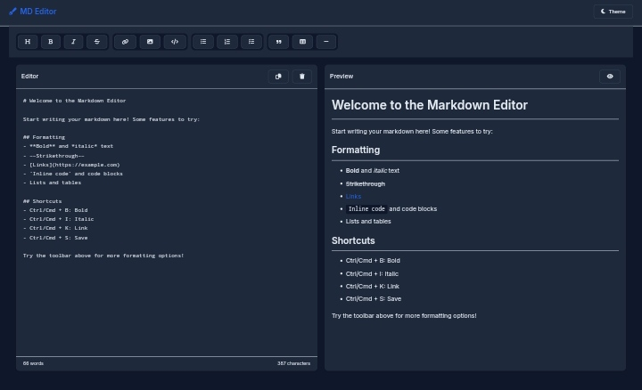

# Markdown Editor

A simple Markdown editor that allows users to format text some various tools.

## Features

- **Text Formatting**: Easily format text with options for bold, italic, strikethrough, and more.
- **Lists**: Create bullet lists, numbered lists, and task lists.
- **Links and Images**: Insert hyperlinks and images into your Markdown content.
- **User -Friendly Interface**: Intuitive buttons for quick access to formatting options.

# Toolbar Options
### Text Formatting:

- Heading
- Bold
- Italic
- Strikethrough

### Lists:

- Bullet List
- Numbered List
- Task List

### Links and Media:

- Insert Link
- Insert Image
- Code Block

# Contributing
Contributions are welcome! If you have suggestions for improvements or new features, feel free to open an issue or submit a pull request.

# License
This project is licensed under the MIT License - see the [LICENSE](LICENSE) file for details.
